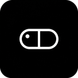

<p align="center">
  
</p>

<h1 align="center">MindCapsule for YouTube</h1>

<p align="center">
  <a href="https://www.youtube.com/"></a>
  <a href="https://developer.chrome.com/docs/extensions/mv3"></a>
  <a href="LICENSE"></a>
</p>

<p align="center">
  用 AI 把 YouTube 长视频变成结构化的「知识胶囊」。<br>
  Turn long YouTube videos into structured knowledge capsules with AI.
</p>

---

## 功能 Features

MindCapsule 在 YouTube 观看页注入一个可折叠的侧边栏（或弹窗），把视频字幕/文稿交给 AI，自动生成四类结构化笔记：

- **一句话总结（TL;DR）** — 用一句话点出视频最核心的论点。
- **内容摘要（Summary）** — 3–5 句话讲清核心思路。
- **关键洞察（Key Insights）** — 3–5 条独立的概念性洞察、观点或结论。
- **时间线（Timeline）** — 带有时间戳（如 `2:30`）的关键片段，方便回看。
- **行动项（Action Items）** — 2–5 条可立即落地的下一步。

MindCapsule automatically extracts the video's caption/transcript (preferring the original-language source track, with optional auto-translation), so you usually don't need to paste anything manually. It then asks your own AI provider to turn that transcript into the four sections above.

Additional highlights:

- **中英双语界面** — popup、设置页、侧边栏三处语言完全同步，改一处其余自动跟随。
- **生成语言可控** — 可跟随视频原语言、强制中文或英文。
- **多家 AI 服务商** — 硅基流动（SiliconFlow）、OpenAI，以及任意 OpenAI 兼容接口（自定义地址 + 自定义模型）。
- **API Key 仅存本地** — 只保存在浏览器 `chrome.storage.local`，不上传、不共享、不读取无关网页内容。
- **面板位置可拖拽、可折叠**，状态本地持久化。

## 安装与使用 Installation

### 从源码加载（开发者模式）

1. 下载并解压本仓库。
2. 打开 `chrome://extensions`，开启右上角「开发者模式」。
3. 点击「加载已解压的扩展程序」，选择本项目文件夹。
4. 点击扩展图标 → 「打开设置」，填写你的 API Key 并选择服务商。
5. 打开任意 YouTube 视频，右侧出现 MindCapsule 面板，点击「生成笔记」。

### From Chrome Web Store

> 即将上架 Chrome Web Store。上架后可直接搜索 "MindCapsule" 一键安装。

## 设置 Settings

在「设置」页（或从 popup 点「打开设置」）可配置：

| 选项 | 说明 |
| --- | --- |
| 界面语言 (UI Language) | 中文 / English，与 popup 和侧边栏同步 |
| 生成语言 (Output Language) | 跟随视频 / 中文 / English |
| AI 服务商 (Provider) | 硅基流动 / OpenAI / 自定义 OpenAI 兼容接口 |
| API Key | 仅保存在本地 |
| 接口地址 (Endpoint) | 仅自定义服务商时需要 |
| 模型 (Model) | 服务商默认模型，或自定义模型名 |

## 技术栈 Tech Stack

- Chrome Manifest V3
- Content Script（隔离世界 + MAIN 世界注入）+ Background Service Worker
- Background 用 `chrome.alarms` 保活，避免长任务被 MV3 生命周期中断
- `chrome.storage.local` 本地存储
- OpenAI 兼容 Chat Completions API（`temperature: 0.6`）

## 隐私 Privacy

- 扩展仅在用户主动点击「生成笔记」时，向你所配置的 AI 服务商发送「视频标题 + 字幕文稿」。
- API Key 仅存于本地 `chrome.storage.local`，不会被扩展读取或发送到任何第三方。
- 扩展不收集、不上传、不共享任何个人数据。
- 仅 `fetch` 调用你配置的服务商 API，所有代码均打包在扩展内，未使用远程代码。

## 项目结构 Project Structure

```
MindCapsule/
├── manifest.json
├── _locales/            # en + zh_CN 双语元信息
├── shared/              # storage-keys / constants / i18n
├── background/
│   └── service-worker.js
├── content/
│   ├── inject.js        # MAIN world 注入，读取页面视频元信息
│   ├── youtube-sidebar.js
│   └── sidebar.css
├── popup/
├── options/
├── ai/
│   └── ai-service.js
├── store-assets/        # 图标 / 截图 / 宣传图
└── scripts/             # 素材生成脚本
```

## 许可证 License

Non-Commercial License（非商业使用许可）。可免费用于个人、教育或非商业目的；用于商业目的需事先获得版权所有者书面许可。详见 [LICENSE](LICENSE)。

---

MindCapsule for YouTube — Turn every video into a knowledge capsule.
